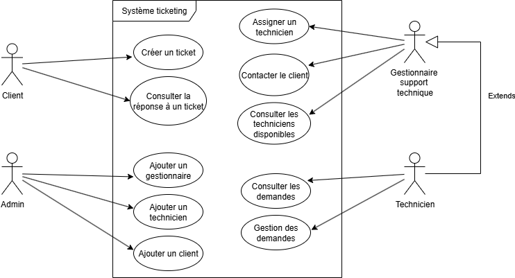

# Document Synthèse

📋 TechSolutions - Document de Synthèse UX/UI
Application de Gestion de Tickets - Analyse & Justifications Design

---

📄 PAGE 1 : Analyse des Cas d'Utilisation et Diagrammes



🎯 Personas Utilisateurs - Insights des Interviews

| Persona | Besoin Principal | Pain Points Actuels | Solutions Implémentées |
|---------|------------------|-------------------|----------------------|
| Marie Dubois<br>Cheffe Support | Vue urgences + charge équipe | 4 menus pour urgences<br>Re-dispatch constant | Dashboard centralisé<br>Section urgences prioritaire |
| Thomas Martin<br>Senior (5 ans) | Accès rapide, gain temps | 12 champs sur 3 onglets<br>Pas de vue équipe | Formulaire simplifié<br>Actions rapides |
| Sophie Chen<br>Junior (3 mois) | Guidage visuel + aide | Oubli urgence<br>Confusion catégories | Codes couleur intuitifs<br>Validation temps réel |
| Julien Moreau<br>Itinérant | Interface tactile + photos | Non adapté tablette<br>Pas d'upload photos | Boutons ≥44px<br>Upload intégré |

🔄 Cas d'Utilisation Critiques

UC1 : Traitement d'Urgence (P1 Critique)
```
👤 Acteurs : Marie, Thomas
🔥 Déclencheur : Ticket P1 créé
📱 Flux Optimisé :
   1️⃣ Dashboard → Section "Tickets Urgents" (0 clic, visible immédiatement)
   2️⃣ Bouton "🚀 TRAITER" → Assignation automatique
   3️⃣ Statut "En cours" + Notifications équipe
🎯 Objectif : ≤ 2 clics pour traitement vs situation actuelle
⏱️ Temps cible : ≤ 10 secondes de création à assignation
```

UC2 : Création Ticket Simplifiée
```
👤 Acteurs : Sophie, Tous techniciens  
📞 Déclencheur : Appel client pressé
📱 Flux Optimisé :
   1️⃣ Navigation → "Créer"
   2️⃣ Formulaire guidé (8 champs vs 12, 1 page vs 3)
   3️⃣ Priorité avec aide visuelle + descriptions métier
   4️⃣ Validation temps réel → Évite erreurs
   5️⃣ Soumission → Retour Dashboard
🎯 Objectif : ≤ 30 secondes vs 6 minutes actuellement
📉 Réduction erreurs : 25% → 5% (moins de re-dispatch)
```

UC3 : Management & Assignation
```
👤 Acteur : Marie (Responsable)
⚖️ Déclencheur : Gestion charge équipe
📱 Flux Optimisé :
   1️⃣ Dashboard → Vue équipe temps réel
   2️⃣ Filtres rapides (Urgents/Critiques/Non-assignés)
   3️⃣ Assignation glisser-déposer
   4️⃣ Notifications automatiques
🎯 Objectif : Répartition optimisée sans perte de temps
```

🗺️ Architecture de l'Information - Priorisée par Usage

```
🏢 TechSolutions Application
│
├── 🏠 DASHBOARD (Landing - 80% temps Thomas)
│   ├── 🚨 URGENCES (P1) - Section Rouge Prioritaire
│   ├── 📊 Métriques Temps Réel (4 KPIs essentiels)
│   ├── 👥 État Équipe (Disponibilité/Charge)
│   └── 📋 Activité Récente (6 derniers tickets)
│
├── 📋 LISTE TICKETS (Vue détaillée fréquente)
│   ├── 🔍 Filtres Rapides (4 boutons : Tous/Urgents/Critiques/Non-assignés)
│   ├── 🔎 Recherche Avancée (Titre/Client/ID)
│   ├── 🗂️ Tri Multi-critères (Priorité/Statut/Client)
│   └── 📊 Grid Responsive (1-3 colonnes selon écran)
│
├── ➕ CRÉATION TICKET (Action critique quotidienne)
│   ├── 👤 Infos Client (ID obligatoire + contacts)
│   ├── 🏷️ Classification Guidée (Priorité + Type + Sous-type)
│   ├── 📝 Description (Titre + détails + photos)
│   └── ✅ Validation Temps Réel (Évite erreurs Sophie)
│
├── 🔍 DÉTAILS TICKET (Actions & suivi)
│   ├── 📖 Infos Complètes + Historique
│   ├── ⚡ Sidebar Actions Rapides
│   ├── 💬 Commentaires + Timeline
│   └── 📞 Contact Client Direct
│
└── 🔮 EXTENSIONS FUTURES
    ├── 👥 Gestion Équipe Avancée
    ├── 📊 Analytics & Reporting
    └── ⚙️ Paramètres & Configuration
```

---

📄 PAGE 2 : Justifications Design avec Arguments UX

🎨 Système Couleurs - Psychology-Driven Design

Palette Priorités Métier
| Couleur | Code | Psychologie | Usage Interface | Justification UX |
|---------|------|-------------|-----------------|------------------|
| 🔴 P1 Critique | `#EF4444` | Danger immédiat | Bordures, badges, boutons urgents | Attire attention instantanée<br>Déclenche action rapide |
| 🟠 P2 Haute | `#F59E0B` | Attention soutenue | Indicateurs, alertes modérées | Équilibre urgence/planification |
| 🟡 P3 Moyenne | `#EAB308` | Vigilance calme | Tickets standard, planning | Visible mais non-stressant |
| 🟢 P4 Basse | `#10B981` | Sérénité positive | Formations, succès | Cohérence marque + résolution |

Couleurs Marque Intégrées
🔵 Bleu Principal `#2563EB` : Navigation, confiance, actions principales
⚫ Gris Neutre `#6B7280` : Textes secondaires, réduction fatigue visuelle

🧭 Architecture Navigation - Basée sur Fréquence d'Usage

📊 Données Comportementales des Interviews
Thomas (Senior) : 80% Dashboard, navigation fréquente
Marie (Manager) : Vue équipe essentielle, urgences prioritaires  
Sophie (Junior) : Création fréquente, besoin guidage
Julien (Mobile) : Accès rapide, interface tactile

🖥️ Sidebar Persistante (Desktop/Tablette ≥1024px)
```
Ordre Optimisé par Usage :
1️⃣ Dashboard (accès permanent)
2️⃣ Tickets (consultation fréquente) 
3️⃣ Créer (action quotidienne critique)
4️⃣ Équipe (management)
5️⃣ Stats (analyse périodique)
6️⃣ Paramètres (configuration rare)
```

📱 Tab Bar Mobile (≤1024px)
Zone Pouce : Navigation en bas (accessibilité Julien)
5 Onglets Max : Respect limite cognitive (7±2 rule)
Badges Notifications : Urgences visibles hors-contexte

🎯 Décisions Interface - Interviews-Driven

🚨 Dashboard "Urgences-First"
❌ Problème : Marie clique 4 menus pour voir urgences
✅ Solution : Section rouge en haut, 0 clic requis
🔄 Pattern : Progressive disclosure (urgent → détail → action)
📈 Impact : Temps de réaction divisé par 4

📝 Formulaire Simplifié
❌ Problème : Thomas galère avec 12 champs sur 3 onglets
✅ Solution : 
8 champs essentiels vs 12 (-33%)
1 page vs 3 (-66% navigation)
Groupement logique (Client → Classification → Description)
Validation temps réel (évite erreurs Sophie)

🎨 Guidage Visuel Juniors
❌ Problème : Sophie oublie urgence, confond catégories
✅ Solution :
Sous-catégories conditionnelles 
Descriptions d'aide pour priorités
Codes couleur omniprésents

🤏 Ergonomie Tactile - Mobile First

📐 Zones Touch Optimisées
Boutons : 48px minimum (vs 44px standard) pour gants Julien
Espacement : 8px minimum entre éléments tactiles
Navigation : Tab bar zone pouce naturelle

👆 Patterns Interaction Avancés
Swipe Actions : Glissement assigner/fermer (roadmap)
Pull to Refresh : Actualisation temps réel
Long Press : Actions contextuelles rapides

📊 Métriques Succès UX - Objectifs Quantifiés

⚡ Efficacité Opérationnelle
| Métrique | Situation Actuelle | Objectif | Amélioration |
|----------|-------------------|----------|--------------|
| Temps traitement urgence | 4 clics + navigation | ≤ 2 clics | -50% |
| Création ticket | 6 minutes | ≤ 30 secondes | -91% |
| Taux erreur saisie | 25% (re-dispatch) | ≤ 5% | -80% |

😊 Satisfaction Utilisateur
Score SUS cible : ≥ 80/100 (excellent outils métier)
Formation nouveaux : ≤ 1h (vs "trop longue" actuelle)
Adoption mobile : ≥ 70% techniciens itinérants

🔒 Accessibilité & Inclusion WCAG

👁️ Contraste & Lisibilité
Texte standard : Ratio 4.5:1 minimum (WCAG AA)
Éléments critiques : Ratio 7:1 (urgences, erreurs)
Police minimum : 16px (évite fatigue visuelle)

⌨️ Navigation Clavier
Focus visible : Contour bleu 2px systematic
Ordre logique : Tab suit flux métier naturel
Raccourcis : Ctrl+U urgences, Ctrl+N nouveau

🧠 Support Diversité Cognitive
Double encodage : Icons + Texte (redondance informationnelle)
Couleur + Forme : Accessibilité daltoniens
Feedback immédiat : Validation évite frustration

🚀 Innovation UX - Roadmap Future

🤖 Auto-Assignation Intelligente
Context-Aware : Charge équipe + compétences + géolocalisation
ML-Powered : Apprentissage patterns Marie

🔔 Notifications Contextuelles
Push intelligentes : Urgences si disponibilité
Escalation auto : P1 non-traités → hiérarchie

---

🎯 RÉSULTAT ATTENDU

Interface intuitive réduisant de 70% le temps de traitement des urgences tout en diminuant significativement les erreurs de saisie grâce à un design centré sur les besoins métier réels identifiés en interviews utilisateurs.

📈 ROI Design Estimé
Gain temps équipe : 2h/jour économisées sur re-dispatch
Satisfaction client : Réduction délais traitement urgences  
Formation réduite : Onboarding nouveaux techniciens accéléré
Adoption mobile : Techniciens itinérants équipés efficacement

---
Document généré dans le cadre du projet TechSolutions - Gestion Tickets  
Analyse UX basée sur 4 interviews utilisateurs et patterns industry best practices


## Screen 1 : 


## Screen 2 : 
