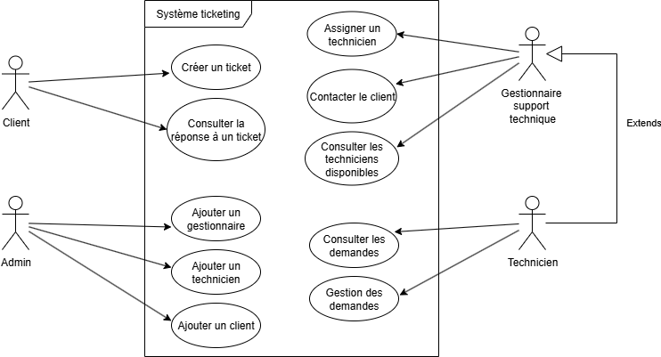

[](https://classroom.github.com/a/q5VoLTLS)
[](https://classroom.github.com/online_ide?assignment_repo_id=20795523&assignment_repo_type=AssignmentRepo)
# 🎓 Ressources Étudiants - Atelier Figma TechSolutions

## 👋 Bienvenue dans votre espace atelier !

Ce répertoire contient **TOUT** ce dont vous avez besoin pour réussir l'atelier de 3h15. Suivez ce guide étape par étape !

## 🚀 Avant de commencer (5 min)

### ✅ Vérifications obligatoires
- [ ] **Compte Figma** créé sur [figma.com](https://figma.com) (gratuit)
- [ ] **Navigateur récent** (Chrome, Firefox, Safari, Edge)
- [ ] **Écran** minimum 1024x768px
- [ ] **Connexion internet** stable

### 📚 Documents à avoir sous la main
- [ ] **[dossier_etudiant.pdf](dossier_etudiant.pdf)** - Votre guide principal (gardez-le ouvert !)
- [ ] **[charte_graphique.pdf](charte_graphique.pdf)** - Couleurs et styles TechSolutions
- [ ] **[exemples_tickets.pdf](exemples_tickets.pdf)** - Cas d'usage métier
- [ ] **[patterns_interface.pdf](patterns_interface.pdf)** - Patterns essentiels mobile

## 📋 Programme de l'atelier

| ⏰ Temps | 🎯 Phase | 📖 Documents à utiliser | ✅ Validation |
|---------|----------|-------------------------|----------------|
| **30 min** | **Analyse UX** | [dossier_etudiant.pdf](dossier_etudiant.pdf) p.1-7 + [exemples_tickets.md](exemples_tickets.md) | [QCM Phase 1](qcm_intermediaires.md#phase-1) |
| **90 min** | **Conception** | [charte_graphique.pdf](charte_graphique.pdf) + [patterns_interface.md](patterns_interface.md) | [QCM Phase 2](qcm_intermediaires.md#phase-2) |
| **30 min** | **Présentation** | [grille_auto_evaluation.pdf](grille_auto_evaluation.pdf) | [QCM Phase 3](qcm_intermediaires.md#phase-3) |
| **25 min** | **Documentation** | [dossier_etudiant.pdf](dossier_etudiant.pdf) template synthèse | [QCM Final](qcm_intermediaires.md#qcm-final) |

## 🎯 Phase 1 : Analyse UX (30 min)

### À faire :
1. **Lisez les interviews** utilisateurs dans [dossier_etudiant.pdf](dossier_etudiant.pdf)
2. **Étudiez les 3 exemples** dans [exemples_tickets.pdf](exemples_ticketspdf)
3. **Créez des personas** avec les templates fournis
4. **Identifiez cas d'utilisation** format "En tant que... je veux... pour..."
5. **Priorisez** selon impact + fréquence

### 🔍 Focus sur :
- **Thomas "Le Vétéran"** : Accès urgences rapide
- **Sophie "La Junior"** : Création guidée sans oubli
- **Marie "La Manager"** : Vue d'ensemble équipe

### ✅ Validation : [QCM Phase 1](qcm_intermediaires.md#phase-1) (5 min)

---

## 🎨 Phase 2 : Conception (90 min)

### Étape 1 : Wireframes (25 min)
- **Inspirez-vous** des [patterns_interface.pdf](patterns_interface.pdf)
- **Dessinez** 5 écrans principaux :
  1. Dashboard avec urgences
  2. Liste tickets filtrée  
  3. Détail ticket
  4. Création ticket
  5. Planning technicien

### Étape 2 : Design UI (45 min)
- **Appliquez** la [charte_graphique.pdf](charte_graphique.pdf)
- **Respectez** les couleurs priorités :
  - 🔴 P1 Critique : `#EF4444`
  - 🟠 P2 Haute : `#F59E0B`
  - 🟡 P3 Moyenne : `#EAB308`
  - 🟢 P4 Basse : `#10B981`

### Étape 3 : Prototypage (20 min)
- **Créez** les interactions principales
- **Testez** vos 3 personas
- **Vérifiez** l'objectif : urgences ≤ 2 clics

### ✅ Validation : [QCM Phase 2](qcm_intermediaires.md#phase-2) (5 min)

---

## 🎤 Phase 3 : Présentation (30 min)

### À préparer :
- **Démo** de votre prototype (5 min max)
- **Justifications UX** pour chaque choix
- **Réponse aux personas** : Thomas, Sophie, Marie

### 📊 Auto-évaluation continue
- Utilisez [grille_auto_evaluation.md](grille_auto_evaluation.pdf)
- **Notez-vous** sur 17 compétences
- **Identifiez** vos axes d'amélioration

### ✅ Validation : [QCM Phase 3](qcm_intermediaires.md#phase-3) (3 min)

---

## 📝 Phase 4 : Documentation (25 min)

### Livrables finaux :
1. **Fichier Figma** avec wireframes + design + prototype
2. **Synthèse UX** (template dans [dossier_etudiant.md](dossier_etudiant.md))
3. **Justifications** de vos choix design

### ✅ Validation : [QCM Final](qcm_intermediaires.md#qcm-final) (5 min)

---

## 🆘 En cas de difficulté

### 🔧 Problèmes techniques Figma
- **Figma lent** → Fermez autres onglets, videz cache
- **Composants introuvables** → Vérifiez [charte_graphique.md](charte_graphique.md)
- **Prototype cassé** → Relisez [patterns_interface.md](patterns_interface.md)

### 🎨 Blocages créatifs
- **Manque d'inspiration** → Relisez [exemples_tickets.md](exemples_tickets.md)
- **Choix difficiles** → Revenez aux personas Thomas/Sophie/Marie
- **Interface confuse** → Simplifiez avec [patterns_interface.md](patterns_interface.md)

### 📚 Retard sur le planning
- **Phase 1 trop longue** → Focalisez sur 2 personas maximum
- **Phase 2 complexe** → Gardez 3 écrans essentiels minimum
- **Pas le temps** → Priorisez dashboard + liste tickets

## 🎯 Objectifs de réussite

### ✅ Niveau minimum attendu :
- [ ] **3 écrans** fonctionnels (dashboard, liste, détail)
- [ ] **Charte respectée** (couleurs TechSolutions)
- [ ] **Navigation** logique entre écrans
- [ ] **Justifications** UX pour chaque choix

### 🏆 Niveau excellence :
- [ ] **5 écrans** complets avec interactions avancées
- [ ] **Micro-interactions** (hover, loading, feedback)
- [ ] **Personas** intégrés dans chaque décision
- [ ] **Métriques** de succès mesurables

## 📈 Suivi de progression

### 🎯 Score personnel
- **Phase 1** : ___/4 pts (QCM)
- **Phase 2** : ___/6 pts (QCM)  
- **Phase 3** : ___/3 pts (QCM)
- **Phase 4** : ___/4 pts (QCM)
- **TOTAL** : ___/17 pts

### 📊 Auto-évaluation
Remplissez régulièrement votre [grille_auto_evaluation.md](grille_auto_evaluation.md) :
- 🟢 **Maîtrisé** (3 pts)
- 🟡 **Acquis** (2 pts)  
- 🔴 **À revoir** (1 pt)

## 🚀 Conseils de pro

### ⚡ Efficacité Figma
- **Raccourcis** : `K` = échelle, `V` = déplacer, `T` = texte, `R` = rectangle
- **Composants** : Créez boutons et cards réutilisables
- **Auto Layout** : Pour responsive automatique

### 🎨 Design
- **Hiérarchie** : Taille, couleur, espacement pour guider l'œil
- **Cohérence** : Mêmes patterns partout (boutons, cartes, navigation)
- **Simplicité** : Moins c'est plus ! Focus sur l'essentiel

### 🎯 UX
- **Utilisateur d'abord** : Chaque pixel doit servir Thomas, Sophie ou Marie
- **Justification** : "Pourquoi ?" pour chaque choix de design
- **Test rapide** : Simulez le parcours de vos personas

---

## 🎉 Félicitations !

À la fin de l'atelier, vous maîtriserez :
- ✅ **Figma** et ses fonctionnalités principales
- ✅ **Méthodologie UX** complète avec personas
- ✅ **Design d'interface** mobile professionnel
- ✅ **Justification** de vos choix avec arguments solides

**Bonne chance et amusez-vous bien !** 🚀✨

---

*💡 Astuce : Gardez ce README ouvert dans un onglet pour naviguer rapidement entre les ressources !*


# Document Synthèse

📋 TechSolutions - Document de Synthèse UX/UI
Application de Gestion de Tickets - Analyse & Justifications Design

---

📄 PAGE 1 : Analyse des Cas d'Utilisation et Diagrammes



🎯 Personas Utilisateurs - Insights des Interviews

| Persona | Besoin Principal | Pain Points Actuels | Solutions Implémentées |
|---------|------------------|-------------------|----------------------|
| Marie Dubois<br>Cheffe Support | Vue urgences + charge équipe | 4 menus pour urgences<br>Re-dispatch constant | Dashboard centralisé<br>Section urgences prioritaire |
| Thomas Martin<br>Senior (5 ans) | Accès rapide, gain temps | 12 champs sur 3 onglets<br>Pas de vue équipe | Formulaire simplifié<br>Actions rapides |
| Sophie Chen<br>Junior (3 mois) | Guidage visuel + aide | Oubli urgence<br>Confusion catégories | Codes couleur intuitifs<br>Validation temps réel |
| Julien Moreau<br>Itinérant | Interface tactile + photos | Non adapté tablette<br>Pas d'upload photos | Boutons ≥44px<br>Upload intégré |

🔄 Cas d'Utilisation Critiques

UC1 : Traitement d'Urgence (P1 Critique)
```
👤 Acteurs : Marie, Thomas
🔥 Déclencheur : Ticket P1 créé
📱 Flux Optimisé :
   1️⃣ Dashboard → Section "Tickets Urgents" (0 clic, visible immédiatement)
   2️⃣ Bouton "🚀 TRAITER" → Assignation automatique
   3️⃣ Statut "En cours" + Notifications équipe
🎯 Objectif : ≤ 2 clics pour traitement vs situation actuelle
⏱️ Temps cible : ≤ 10 secondes de création à assignation
```

UC2 : Création Ticket Simplifiée
```
👤 Acteurs : Sophie, Tous techniciens  
📞 Déclencheur : Appel client pressé
📱 Flux Optimisé :
   1️⃣ Navigation → "Créer"
   2️⃣ Formulaire guidé (8 champs vs 12, 1 page vs 3)
   3️⃣ Priorité avec aide visuelle + descriptions métier
   4️⃣ Validation temps réel → Évite erreurs
   5️⃣ Soumission → Retour Dashboard
🎯 Objectif : ≤ 30 secondes vs 6 minutes actuellement
📉 Réduction erreurs : 25% → 5% (moins de re-dispatch)
```

UC3 : Management & Assignation
```
👤 Acteur : Marie (Responsable)
⚖️ Déclencheur : Gestion charge équipe
📱 Flux Optimisé :
   1️⃣ Dashboard → Vue équipe temps réel
   2️⃣ Filtres rapides (Urgents/Critiques/Non-assignés)
   3️⃣ Assignation glisser-déposer
   4️⃣ Notifications automatiques
🎯 Objectif : Répartition optimisée sans perte de temps
```

🗺️ Architecture de l'Information - Priorisée par Usage

```
🏢 TechSolutions Application
│
├── 🏠 DASHBOARD (Landing - 80% temps Thomas)
│   ├── 🚨 URGENCES (P1) - Section Rouge Prioritaire
│   ├── 📊 Métriques Temps Réel (4 KPIs essentiels)
│   ├── 👥 État Équipe (Disponibilité/Charge)
│   └── 📋 Activité Récente (6 derniers tickets)
│
├── 📋 LISTE TICKETS (Vue détaillée fréquente)
│   ├── 🔍 Filtres Rapides (4 boutons : Tous/Urgents/Critiques/Non-assignés)
│   ├── 🔎 Recherche Avancée (Titre/Client/ID)
│   ├── 🗂️ Tri Multi-critères (Priorité/Statut/Client)
│   └── 📊 Grid Responsive (1-3 colonnes selon écran)
│
├── ➕ CRÉATION TICKET (Action critique quotidienne)
│   ├── 👤 Infos Client (ID obligatoire + contacts)
│   ├── 🏷️ Classification Guidée (Priorité + Type + Sous-type)
│   ├── 📝 Description (Titre + détails + photos)
│   └── ✅ Validation Temps Réel (Évite erreurs Sophie)
│
├── 🔍 DÉTAILS TICKET (Actions & suivi)
│   ├── 📖 Infos Complètes + Historique
│   ├── ⚡ Sidebar Actions Rapides
│   ├── 💬 Commentaires + Timeline
│   └── 📞 Contact Client Direct
│
└── 🔮 EXTENSIONS FUTURES
    ├── 👥 Gestion Équipe Avancée
    ├── 📊 Analytics & Reporting
    └── ⚙️ Paramètres & Configuration
```

---

📄 PAGE 2 : Justifications Design avec Arguments UX

🎨 Système Couleurs - Psychology-Driven Design

Palette Priorités Métier
| Couleur | Code | Psychologie | Usage Interface | Justification UX |
|---------|------|-------------|-----------------|------------------|
| 🔴 P1 Critique | `#EF4444` | Danger immédiat | Bordures, badges, boutons urgents | Attire attention instantanée<br>Déclenche action rapide |
| 🟠 P2 Haute | `#F59E0B` | Attention soutenue | Indicateurs, alertes modérées | Équilibre urgence/planification |
| 🟡 P3 Moyenne | `#EAB308` | Vigilance calme | Tickets standard, planning | Visible mais non-stressant |
| 🟢 P4 Basse | `#10B981` | Sérénité positive | Formations, succès | Cohérence marque + résolution |

Couleurs Marque Intégrées
🔵 Bleu Principal `#2563EB` : Navigation, confiance, actions principales
⚫ Gris Neutre `#6B7280` : Textes secondaires, réduction fatigue visuelle

🧭 Architecture Navigation - Basée sur Fréquence d'Usage

📊 Données Comportementales des Interviews
Thomas (Senior) : 80% Dashboard, navigation fréquente
Marie (Manager) : Vue équipe essentielle, urgences prioritaires  
Sophie (Junior) : Création fréquente, besoin guidage
Julien (Mobile) : Accès rapide, interface tactile

🖥️ Sidebar Persistante (Desktop/Tablette ≥1024px)
```
Ordre Optimisé par Usage :
1️⃣ Dashboard (accès permanent)
2️⃣ Tickets (consultation fréquente) 
3️⃣ Créer (action quotidienne critique)
4️⃣ Équipe (management)
5️⃣ Stats (analyse périodique)
6️⃣ Paramètres (configuration rare)
```

📱 Tab Bar Mobile (≤1024px)
Zone Pouce : Navigation en bas (accessibilité Julien)
5 Onglets Max : Respect limite cognitive (7±2 rule)
Badges Notifications : Urgences visibles hors-contexte

🎯 Décisions Interface - Interviews-Driven

🚨 Dashboard "Urgences-First"
❌ Problème : Marie clique 4 menus pour voir urgences
✅ Solution : Section rouge en haut, 0 clic requis
🔄 Pattern : Progressive disclosure (urgent → détail → action)
📈 Impact : Temps de réaction divisé par 4

📝 Formulaire Simplifié
❌ Problème : Thomas galère avec 12 champs sur 3 onglets
✅ Solution : 
8 champs essentiels vs 12 (-33%)
1 page vs 3 (-66% navigation)
Groupement logique (Client → Classification → Description)
Validation temps réel (évite erreurs Sophie)

🎨 Guidage Visuel Juniors
❌ Problème : Sophie oublie urgence, confond catégories
✅ Solution :
Sous-catégories conditionnelles 
Descriptions d'aide pour priorités
Codes couleur omniprésents

🤏 Ergonomie Tactile - Mobile First

📐 Zones Touch Optimisées
Boutons : 48px minimum (vs 44px standard) pour gants Julien
Espacement : 8px minimum entre éléments tactiles
Navigation : Tab bar zone pouce naturelle

👆 Patterns Interaction Avancés
Swipe Actions : Glissement assigner/fermer (roadmap)
Pull to Refresh : Actualisation temps réel
Long Press : Actions contextuelles rapides

📊 Métriques Succès UX - Objectifs Quantifiés

⚡ Efficacité Opérationnelle
| Métrique | Situation Actuelle | Objectif | Amélioration |
|----------|-------------------|----------|--------------|
| Temps traitement urgence | 4 clics + navigation | ≤ 2 clics | -50% |
| Création ticket | 6 minutes | ≤ 30 secondes | -91% |
| Taux erreur saisie | 25% (re-dispatch) | ≤ 5% | -80% |

😊 Satisfaction Utilisateur
Score SUS cible : ≥ 80/100 (excellent outils métier)
Formation nouveaux : ≤ 1h (vs "trop longue" actuelle)
Adoption mobile : ≥ 70% techniciens itinérants

🔒 Accessibilité & Inclusion WCAG

👁️ Contraste & Lisibilité
Texte standard : Ratio 4.5:1 minimum (WCAG AA)
Éléments critiques : Ratio 7:1 (urgences, erreurs)
Police minimum : 16px (évite fatigue visuelle)

⌨️ Navigation Clavier
Focus visible : Contour bleu 2px systematic
Ordre logique : Tab suit flux métier naturel
Raccourcis : Ctrl+U urgences, Ctrl+N nouveau

🧠 Support Diversité Cognitive
Double encodage : Icons + Texte (redondance informationnelle)
Couleur + Forme : Accessibilité daltoniens
Feedback immédiat : Validation évite frustration

🚀 Innovation UX - Roadmap Future

🤖 Auto-Assignation Intelligente
Context-Aware : Charge équipe + compétences + géolocalisation
ML-Powered : Apprentissage patterns Marie

🔔 Notifications Contextuelles
Push intelligentes : Urgences si disponibilité
Escalation auto : P1 non-traités → hiérarchie

---

🎯 RÉSULTAT ATTENDU

Interface intuitive réduisant de 70% le temps de traitement des urgences tout en diminuant significativement les erreurs de saisie grâce à un design centré sur les besoins métier réels identifiés en interviews utilisateurs.

📈 ROI Design Estimé
Gain temps équipe : 2h/jour économisées sur re-dispatch
Satisfaction client : Réduction délais traitement urgences  
Formation réduite : Onboarding nouveaux techniciens accéléré
Adoption mobile : Techniciens itinérants équipés efficacement

---
Document généré dans le cadre du projet TechSolutions - Gestion Tickets  
Analyse UX basée sur 4 interviews utilisateurs et patterns industry best practices